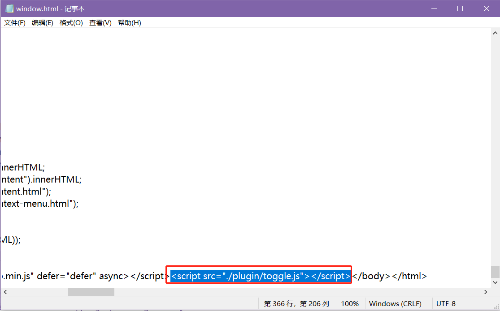
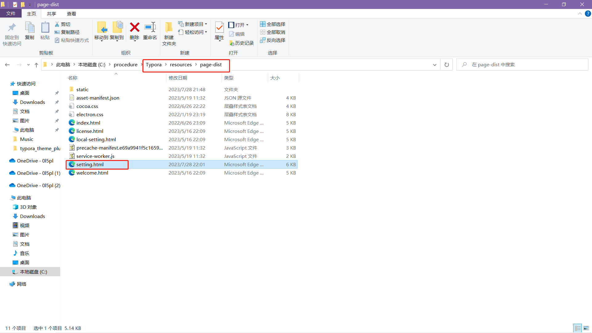
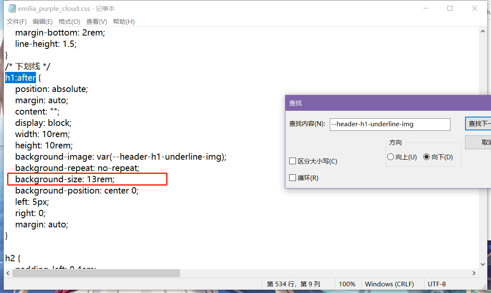

# Typora-Emilia-Theme-Plugin

## 介绍

Typora 是一款由 Abner Lee 开发的[轻量级](https://baike.baidu.com/item/轻量级/10002835?fromModule=lemma_inlink) Markdown 编辑器，与其他 Markdown 编辑器不同的是，Typora 没有采用[源代码](https://baike.baidu.com/item/源代码/3969?fromModule=lemma_inlink)和预览双栏显示的方式，而是采用所见即所得的编辑方式，实现了即时预览的功能，但也可切换至源代码编辑模式。

## 安装

1.从`GitHub`上下载打包好的文件`typora_theme_plugin`。

2.打开`Typora`软件的安装目录下的`resources`文件夹，把下载目录里的`plugin`文件夹拖入里面。

`setting.css`：是软件设置界面的美化，如不需要删掉即可。

`index.js`：是给软件目录旁边添加了一个展开与收起的按键，如不需要删掉即可。

3.打开`Typora`软件安装目录下的`window.html`文件，打开记事本编辑，代码：``。

4.打开`Typora`软件安装目录下的`page-dist`文件夹下的`setting.html`文件，右键打开记事本编辑，方式同上，代码：`<link rel="stylesheet" href="../plugin/setting.css">`。

5.打开`Typoora`软件顶部导航栏`文件`→`偏好设置`→`外观`→`打开主题文件夹`，粘贴下载文件目录下的`emilia_purple_cloud.css`、`emilia_purple_local.css`、`images`，

`emilia_purple_cloud.css`：背景人物图片与H1标题的下划线图片储存到云端的，推荐使用这个，导出`Html`文件时可以直接访问到。

`emilia_purple_local.css`：图片资源存放到本地，更换设备就看不到背景与H1的下划线，解决方法，可以在导出`Html`的`在 <head />中添加`文本框中放入代码更改背景图片的链接地址。

`images`:存放背景人物图片与H1标题下划线图片的文件。

如需使用本地`emilia_purple_local.css`文件导出时背景图与H1标签下的图片存在云端可以添加如下代码：

也可以根据需要在主题文件的root目录中自行更换图片，导出设置也可以更换成自己想要的图片，大小也可以自行更改。

图片存放的是github，国内可能访问不了，电脑可以使用`Watt Toolkit`加速访问。

`--reading-content-background`:

## 演示

### normal：

### theme：

